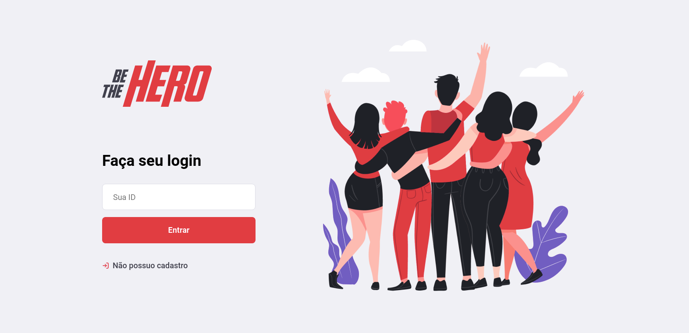

# SRNE 
Frontend: React JS\
Mobile: React Native\
Banco de dados relacional: sqlite3\
Servidor: Node JS, com a biblioteca express

## Sobre o projeto
O projeto é parte do desafio proposto pela semana omnistack, fornecido pelo rocketseat.
Nele, é proposto a construção do backend, com um servidor em Node JS que se conecta com um banco de dados relacional e
o frontend, feito utilizando html/css e react. Inclui uma tela de cadastro e retorno de chave de busca.




### Executando
backend (Node JS)
```
  cd backend/src
  nodemon index.js
```

frontend (React JS)
```
  cd frontend/src
  npm start
```

mobile (React Native)
```
  cd mobile/src
  npm start
```
